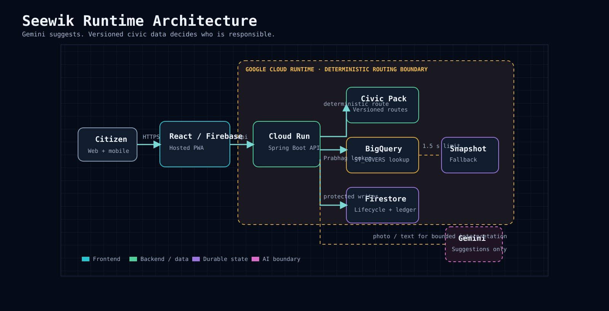

# Seewik

Seewik is a multilingual civic-intelligence platform for Nandurbar. It helps citizens turn a local civic concern into a clear, reviewable action: identify the issue, confirm the location, find the responsible authority, prepare filing-ready wording, and record what happened next.

**Stack:** React, TypeScript and Vite PWA; Java 21 and Spring Boot; Vertex AI Gemini; Firestore; BigQuery; Cloud Run; Firebase Hosting and Authentication; Cloud Storage; Google Maps Platform.

**Live application:** [seewik.web.app](https://seewik.web.app/)

Quick navigation: [Architecture](#architecture) · [Testing](#testing-and-evaluation) · [Cost](#deployment-and-operations) · [Limitations](#known-limitations) · [Documentation](#documentation-and-development-history)

Seewik is an independent prototype, not a government service, emergency-response provider, legal adviser, or proof that a complaint has been submitted.

## Engineering highlights

| Concern | Implementation |
| --- | --- |
| Deterministic routing | Gemini interprets citizen input; the versioned Civic Pack determines the authority, route and official filing channels. |
| Data consistency | Initiative joins are transactional and idempotent, preventing duplicate participation and incorrect counts. |
| Auditable history | Lifecycle and points records are append-only; private organiser archive preferences never erase participant history. |
| Access control | Firebase identity is verified at the backend; owner-scoped and backend-owned writes protect reports, Initiatives, attendance, points and recognition. |
| Failure recovery | Model timeouts, BigQuery circuit breaking, a 1.5-second routing ceiling, packaged snapshot fallback and manual citizen recovery paths keep the flow usable. |
| Delivery | A tested Cloud Run candidate is health-checked before traffic moves; the same revision builds Firebase Hosting and supports rollback. |

The project treats debugging as engineering evidence: incognito testing isolated stale anonymous-token recovery; invalid image-model output is rejected by schema validation; blank-audio civic hallucinations are blocked; and dependency pins are verified before remediation.

## Product walkthrough

1. **Improve:** add a photograph or description, review or edit the suggested category and location, then use the deterministic Civic Pack route and complaint draft.
2. **Initiate:** create or join local activities with an organiser-confirmed public meeting point, participant directions, attendance and completion states.
3. **Inspire:** view a private Civic Card, lifetime recognition points, opt-in recognition and clearly illustrative local rewards.
4. **Information:** read sourced civic-awareness content and reach verified emergency numbers through direct call actions.

The interface is available in English, Marathi and Hindi. Seewik never submits a complaint automatically: the citizen reviews the route and wording, then files it through the practical option they choose.

## Architecture



> Gemini understands the citizen; versioned civic data decides who is responsible.

The React PWA is hosted on Firebase and calls the Spring Boot API on Cloud Run. Gemini supplies bounded category and drafting assistance only. The Civic Pack supplies deterministic authority and filing data. BigQuery applies `ST_COVERS` to the approximate Prabhag trace with a 1.5-second timeout; a packaged snapshot provides a safe fallback. Firestore stores owner-scoped reports, Initiative lifecycle data and ledgers, while Cloud Storage protects citizen-owned media.

## API and data model

The API covers classification, Prabhag resolution, deterministic routing, complaint drafting, report lifecycle, Initiatives, attendance, recognition and reward simulation.

- Durable actions verify Firebase identity in the backend.
- Report snapshots preserve the Civic Pack, boundary version and canonical route data used for each recommendation.
- Initiative creation, joins, attendance and completion use transactional, idempotent writes.
- Lifecycle and points records are append-only; private archive preferences are separate from shared activity state.
- Versioned request, response and data contracts live under `data/contracts/`.

## Run locally

### Safe automated validation

```bash
cd backend && mvn -B test
cd frontend && npm ci && npm test && npm run build
cd frontend && npm run test:rules:emulator
```

Rules run against disposable emulators, never the production project.

### Local browser development

Vite proxies same-origin `/api` requests to a local backend by default. Start the backend on port `8080`, then Vite:

```bash
cd backend && mvn spring-boot:run
cd frontend && npm run dev
```

Use the local-e2e profile only with Firebase Auth and Firestore emulators or an isolated development project. Never use production credentials, production Firebase configuration, or realistic citizen data for local experimentation. Google Maps place search is optional and uses a restricted browser key in `frontend/.env.local`; never commit it.

## Testing and evaluation

Current local evidence recorded on 15 September 2026:

| Evidence | Result |
| --- | --- |
| Backend automated tests | 238 passed |
| Frontend automated tests | 133 passed |
| Firebase security-rule emulator tests | 3 passed |
| Production frontend build | Passed |
| Routing resilience | Forced BigQuery timeout and circuit tests validate the 1.5-second snapshot fallback. |
| Multilingual experience | English, Marathi and Hindi copy is covered across primary citizen flows. |
| Image evaluation | 12/16 schema-valid responses; all 12 valid responses had the correct category. Dataset: `classification-image-cases-v0.1-draft`. |
| Survey baseline | 52 completed Nandurbar respondents and 520 scenario answers; see the business case for scoring scope and limitations. |

Evaluation fixtures are versioned. Private citizen photographs and raw survey exports are not committed.

## Deployment and operations

`quality.yml` runs repository, boundary, backend, frontend, dependency and security-rule checks. `deploy.yml` deploys a no-traffic Cloud Run candidate, verifies health, moves traffic, builds the frontend from the tested revision, deploys Firebase Hosting and rules, checks public routes and retains rollback behavior.

The early-stage measured baseline is **$0.0169 gross per report started** and **$8.43 per month for 500 reports**, before credits. It uses Cloud Billing and Cloud Logging exports from 18 August through 7 September 2026 and includes development and smoke-test activity. See [Cost per request](COST_PER_REQUEST.md).

## Known limitations

- The active Prabhag dataset is `seewik-map-trace-v0.2`, an approximate trace of a municipal wall-map image. It is not authority-verified machine-readable municipal geometry and always requires citizen confirmation.
- Civic Pack desk assignments and service commitments remain review-pending where Nandurbar-specific official publication is unavailable.
- Default email-app handoff and plain-text filing copy were confirmed on Mac and iPhone browsers. Gmail mobile compose parameters are not reliable; copy-ready fallback remains available.
- Device location is optional. Safari location availability can vary by permission and browser state; Google address search and manual Prabhag selection remain durable recovery paths.
- Rewards are labelled **Example local reward**. No merchant onboarding, payment, live redemption, municipal campaign feed or legal guidance is implemented.

Verify the active map trace locally:

```bash
cd data/prabhags
shasum -a 256 -c official-map-digitized-boundaries-v0.2.sha256
```

## Documentation and development history

- [Current build evidence](DAY17_BUILD_LOG.md)
- [Cost per request](COST_PER_REQUEST.md)
- [Touchpoint 3 business case](TOUCHPOINT3_BUSINESS_CASE.md)
- [Security findings](SECURITY_FINDINGS.md)
- [Project file and service map](PROJECT_FILE_MAP.md)
- [Changelog](CHANGELOG.md)
- Historical build logs: `DAY1_BUILD_LOG.md` through `DAY16_BUILD_LOG.md`

Operational handoff notes remain local-only and are intentionally excluded from version control.
